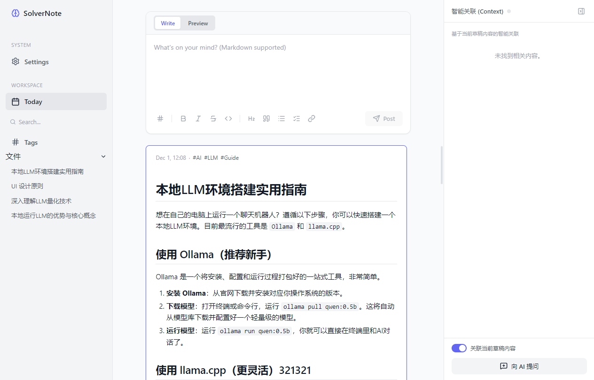
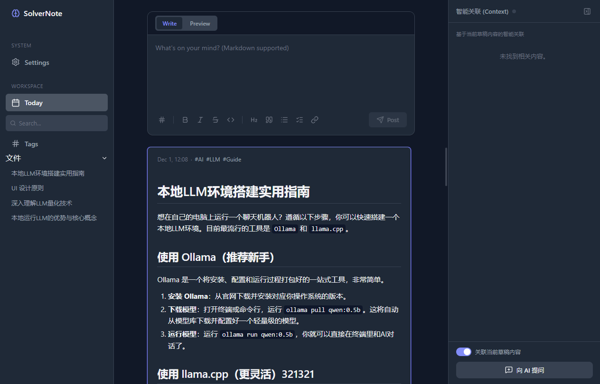
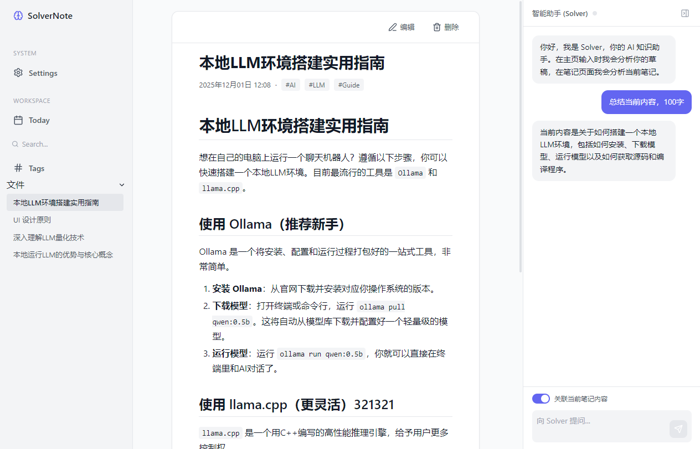

# SolverNote

[](https://opensource.org/licenses/ISC)
[](https://vuejs.org/)
[](https://www.electronjs.org/)
[](https://vitejs.dev/)
[](package.json)

**SolverNote: 您的本地优先、由 AI 驱动的第二大脑。**

SolverNote 是一款桌面知识管理应用，旨在将强大的本地 AI 功能与流畅的笔记体验相结合。所有笔记、数据甚至 AI 模型都完全存储在您的本地计算机上，确保了极致的隐私和数据所有权。无需订阅，无需云端依赖。


## 📸 截图
[浅色模式]


[深色模式]


[单页]


## ✨ 核心功能

*   **✍️ 智能 Markdown 编辑器**: 提供一个功能丰富的 Markdown 编辑器，支持实时预览、语法高亮和便捷的快捷工具栏。
*   **🧠 本地 AI 驱动**:
    *   **上下文感知聊天**: 与内置的 AI 助手 (Solver) 对话，它可以理解您当前正在撰写或查看的笔记内容，提供更精准的回答和建议。
    *   **智能关联 (RAG)**: 在您撰写或查看笔记时，AI 会在侧边栏自动浮现语义上相关的其他笔记片段，即使它们没有共享任何关键词。这有助于您发现知识间的深层联系。
*   **🔒 100% 本地优先与隐私保护**:
    *   所有笔记都以纯文本 Markdown 文件的形式存储在您本地的 `notes` 文件夹中。
    *   AI 模型 (`.gguf` 格式) 下载并运行在您的设备上，您的任何数据都不会离开您的计算机。
*   **⚡ 高性能向量搜索**: 利用 `LanceDB` 在本地构建向量索引，实现笔记内容的毫秒级语义搜索。
*   **📂 文件系统集成**:
    *   通过 `chokidar` 实时监听文件变化，您在外部编辑器中对 `notes` 文件夹的任何修改都会被应用自动索引和同步。
    *   直观的文件树视图，方便您快速导航。
*   **🎨 现代化 UI**:
    *   基于 Vue 3 和 Pinia 构建，响应迅速。
    *   支持浅色、深色模式，并可跟随系统主题自动切换。
    *   简洁的三栏式布局，逻辑清晰。

## 🚀 技术栈

| 类别             | 技术                                                                                             |
| ---------------- | ------------------------------------------------------------------------------------------------ |
| **桌面框架**     | [Electron](https://www.electronjs.org/)                                                          |
| **前端**         | [Vue 3](https://vuejs.org/) (Composition API), [Vite](https://vitejs.dev/), [Pinia](https://pinia.vuejs.org/), [Vue Router](https://router.vuejs.org/) |
| **样式**         | [Sass/SCSS](https://sass-lang.com/)                                                                |
| **AI 核心引擎**  | [node-llama-cpp](https://github.com/withcatai/node-llama-cpp) (用于在本地 CPU 上运行 GGUF 模型)    |
| **向量数据库**   | [@lancedb/lancedb](https://github.com/lancedb/lancedb/tree/main/node) (用于本地向量存储与搜索)   |
| **Markdown**     | [markdown-it](https://github.com/markdown-it/markdown-it), [highlight.js](https://highlightjs.org/) (代码高亮) |
| **构建与打包**   | [Electron Builder](https://www.electron.build/)                                                  |
| **文件系统**     | `fs-extra`, `chokidar`                                                                           |

## 🛠️ 开始使用

### 环境要求

*   [Node.js](https://nodejs.org/) (推荐 v18.x 或更高版本)
*   `npm` 或 `yarn`
*   `Git`

### 安装与运行

1.  **克隆仓库**
    ```bash
    git clone https://github.com/git-hub-cc/SolverNote.git
    cd SolverNote
    ```

2.  **安装依赖**
    ```bash
    npm install
    ```

3.  **运行开发环境**
    ```bash
    npm run dev
    ```
    此命令会同时启动 Vite 开发服务器 (用于前端 UI) 和 Electron 主进程。应用启动后，您会看到一个窗口。

4.  **下载 AI 模型 (重要！)**
    应用首次运行时，核心 AI 功能是不可用的，因为缺少模型文件。
    *   导航到应用左侧菜单的 **"Settings"** 页面。
    *   您会看到 **"AI 模型"** 部分列出了两个必需的模型 (一个用于对话，一个用于嵌入/搜索)。
    *   点击 **"下载"** 按钮，等待模型下载完成。
    *   **下载完成后，请重启应用** (`Ctrl+C` 停止开发服务器后，重新执行 `npm run dev`)，以便 Electron 后端能加载新下载的模型。
    *   您可以在 "AI 服务状态" 面板中确认模型是否已 "准备就绪 (Ready)"。

### 构建可执行文件

要为您的操作系统打包一个可分发的应用，请运行：

```bash
npm run build
```
构建完成后，安装包将出现在项目根目录下的 `dist` 文件夹中。

## 🏗️ 项目架构

SolverNote 遵循标准的 Electron 应用架构，分为两个主要进程：

*   **Main Process (主进程)** - `electron/`
    *   负责创建和管理应用窗口 (`main.js`)。
    *   处理所有与操作系统底层交互的逻辑，如文件读写 (`handlers.js`)、IPC 通信等。
    *   **承载所有 AI 密集型任务**:
        *   `services/llmService.js`: 加载对话模型 (如 Qwen) 并处理聊天流。
        *   `services/vectorService.js`: 加载嵌入模型 (如 BGE)，创建文本向量，并与 LanceDB 交互进行相似性搜索。
        *   `services/modelManager.js`: 负责下载和管理模型文件。
*   **Renderer Process (渲染进程)** - `src/`
    *   负责应用界面的展示和用户交互，是一个完整的 Vue 3 单页应用。
    *   通过 `preload.js` 暴露的 `electronAPI` 与主进程进行安全的异步通信。
    *   使用 Pinia (`src/stores/`) 管理全局状态，如笔记列表、AI 状态等。

### AI 工作流

1.  **笔记索引 (Indexing)**:
    *   应用启动或 `notes` 文件夹发生变化时，`chokidar` 会触发事件。
    *   主进程的 `vectorService` 读取笔记内容，使用 BGE 嵌入模型将其转换为向量。
    *   生成的向量与笔记元数据 (ID, 标题, 文本块) 一同存入本地的 LanceDB 数据库。

2.  **智能关联 (Semantic Search / RAG)**:
    *   当用户在 UI 中查看一篇笔记时，渲染进程通过 IPC 调用主进程的 `vectors:search` 方法。
    *   `vectorService` 将当前笔记的标题或内容作为查询，在 LanceDB 中搜索最相似的向量。
    *   返回的相似笔记片段最终展示在 AI 侧边栏中。

## 📄 许可证

本项目基于 [ISC License](./LICENSE) 许可。详情请见 `LICENSE` 文件。